<div align="center">

[](https://v2.cn.vuejs.org/)
[](https://vuex.vuejs.org/zh/)
[](https://router.vuejs.org/)
[](https://element.eleme.cn/#/zh-CN)
[](https://element.eleme.cn/#/zh-CN)
[](https://opensource.org/licenses/MIT)
[](https://deepwiki.com/OOMEcho/aegis)
## 🍟 如果您觉得有帮助，请点右上角 "Star" 支持一下谢谢

</div>

## 🌟 项目介绍

Aegis是一个功能完整的企业级RBAC(Role-Based Access Control)权限管理系统，采用前后端分离架构设计。系统以权限为核心，
通过用户 -> 角色 -> 权限完成授权，菜单路由与接口资源都通过权限进行关联和控制，可作为企业应用开发的基础框架。

### ✨ 核心特性

- 🔐 **多样化登录**：账号密码、邮箱验证码登录
- 🧩 **滑块验证码**：登录安全校验，降低恶意登录风险
- 🔑 **RSA 加密**：密码加密传输，配合后端公钥
- 🧭 **权限驱动菜单/路由**：基于权限动态生成路由与菜单
- 🎯 **按钮级权限指令**：细粒度操作权限控制
- 🗂️ **标签页导航**：多页签快速切换与缓存
- 🧰 **完整后台模块**：用户/角色/权限/菜单/资源/部门/字典/日志/通知/文件等

## 🔗 相关项目

- 点击跳转[后端仓库](https://github.com/OOMEcho/aegis)

## 🌐 在线演示

- 点击跳转[演示地址](https://aegis.lxsblogs.cn)

## 🔐 默认账号

- 管理员账号：
  - 账号：`admin`
  - 密码：`123456`
- 普通用户账号：
  - 账号：`visitor`
  - 密码：`123456`

## 🏗️ 技术架构

### 🧱 技术栈

| 技术         | 版本      | 说明      |
|------------|---------|---------|
| Vue        | 2.7.16  | 前端框架    |
| Vue Router | 3.6.2   | 路由管理    |
| Vuex       | 3.6.2   | 状态管理    |
| Element UI | 2.15.14 | 组件库     |
| Axios      | 1.11.0  | HTTP 请求 |
| Echarts    | 4.9.0   | 图表展示    |
| wangeditor | 4.7.15  | 富文本     |
| JSEncrypt  | 3.5.4   | RSA 加密  |
| NProgress  | 0.2.0   | 路由进度条   |

## 🚀 快速开始

### 环境要求

- Node.js
- npm

### 本地开发

1. **克隆项目**
```bash
git clone https://github.com/OOMEcho/aegis-vue.git
cd aegis-vue
```

2. **安装依赖**

```bash
npm install
```

3. **配置环境变量**

开发环境：`.env.development`

```bash
VUE_APP_BASE_PRE = '/api'
VUE_APP_BASE_API = 'http://127.0.0.1:8080'
```

生产环境：`.env.production`

```bash
VUE_APP_BASE_PRE = '/prod-api'
VUE_APP_BASE_API = 'http://127.0.0.1:8080'
```

说明：`VUE_APP_BASE_PRE` 作为请求前缀用于本地代理转发，`VUE_APP_BASE_API` 指向后端服务地址。

4. **启动开发服务**

```bash
npm run serve
```

默认端口：`http://localhost:9090`

### 构建生产包

```bash
npm run build
```

构建产物输出到 `dist` 目录。

## 📦 功能模块

### 🎯 核心模块

| 模块 | 功能描述 |
|------|----------|
| **用户管理** | 用户增删改查、状态管理、密码重置、在线状态、强制下线 |
| **角色管理** | 角色配置、权限分配、数据权限设置 |
| **权限管理** | 权限编码维护、状态控制 |
| **资源管理** | URL/Method与权限映射 |
| **菜单管理** | 菜单配置、权限关联、路由管理 |
| **部门管理** | 组织架构、层级管理、部门权限 |
| **字典管理** | 系统字典、配置管理 |
| **日志管理** | 操作日志、登录日志、导出 |
| **文件管理** | 文件上传、存储管理、访问控制 |
| **通知公告** | 系统通知、公告发布、消息推送、定时发布 |
| **IP白名单** | 访问控制、安全防护 |
| **限流控制** | 接口访问频率限制、防刷机制 |
| **数据脱敏** | 敏感数据保护、多种脱敏规则 |

### 🔒 安全特性

#### 认证机制
- **密码认证**: 传统用户名密码登录
- **邮箱认证**: 邮箱验证码登录
- **短信认证**: 手机短信验证码登录
- **RSA加密**: 密码传输加密保护

#### 权限控制
- **权限模型**: 用户 -> 角色 -> 权限
- **URL级权限**: 资源与权限映射控制接口访问
- **菜单级权限**: 菜单与权限关联控制路由
- **按钮级权限**: 细粒度操作权限控制
- **数据级权限**: 行级数据访问控制

#### 数据权限类型
- **全部数据权限**: 无限制访问
- **自定义数据权限**: 按指定部门范围
- **部门数据权限**: 按所属部门
- **部门及以下数据权限**: 按部门层级
- **仅本人数据权限**: 仅访问本人数据

## 🏛️ 系统架构

### 包结构

```
src/
├── api/               # 接口封装
├── assets/            # 静态资源
├── components/        # 通用组件
├── directive/         # 权限指令
├── mixins/            # 通用混入
├── router/            # 路由配置
├── store/             # Vuex 状态
├── utils/             # 工具库
├── views/             # 页面视图
├── App.vue            # 根组件
└── main.js            # 入口文件
```

## 🖼️ 项目截图

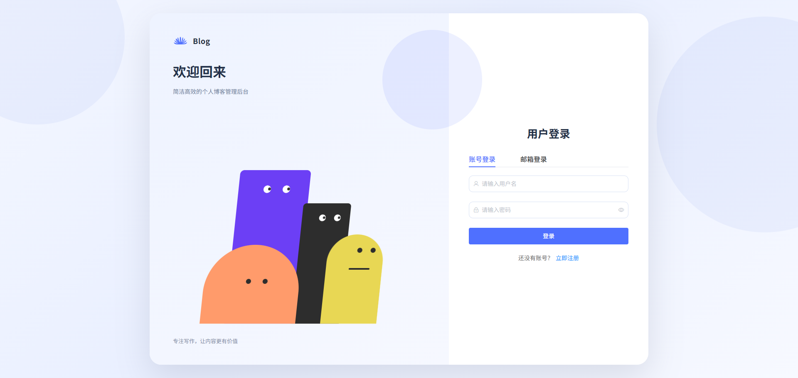
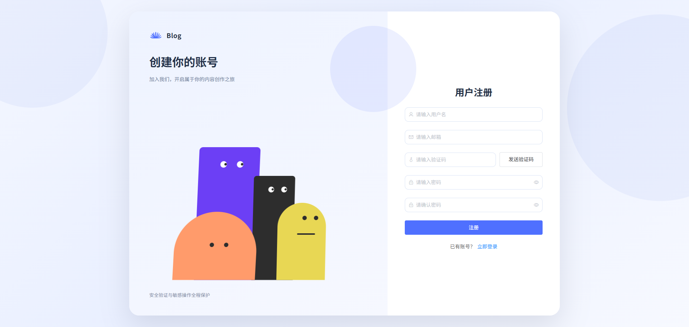
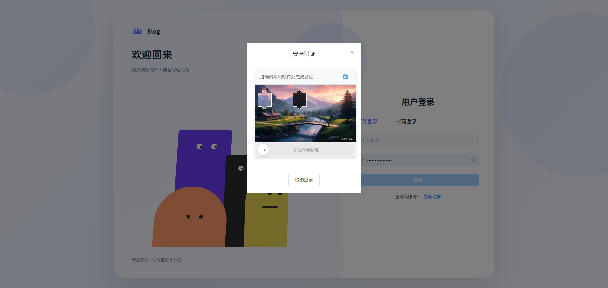
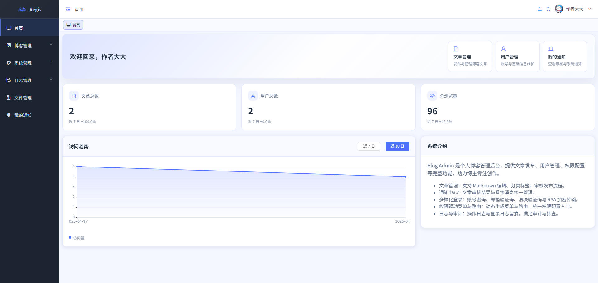
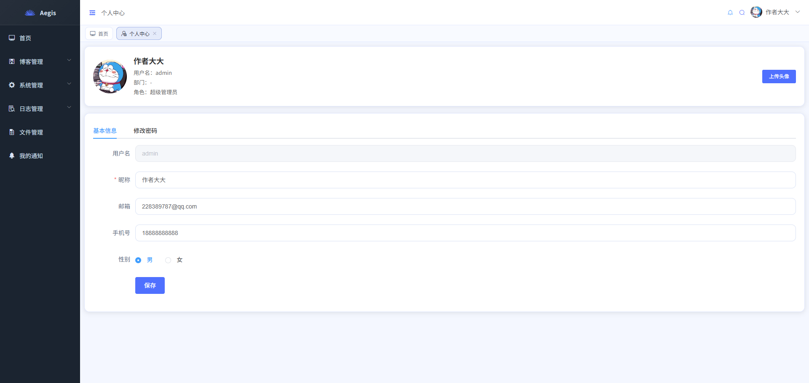
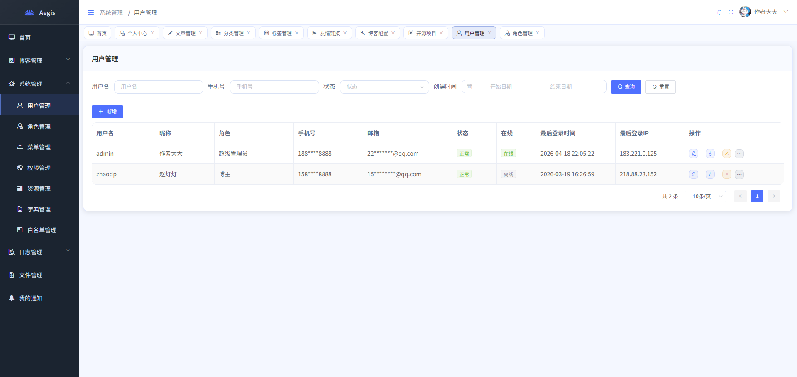
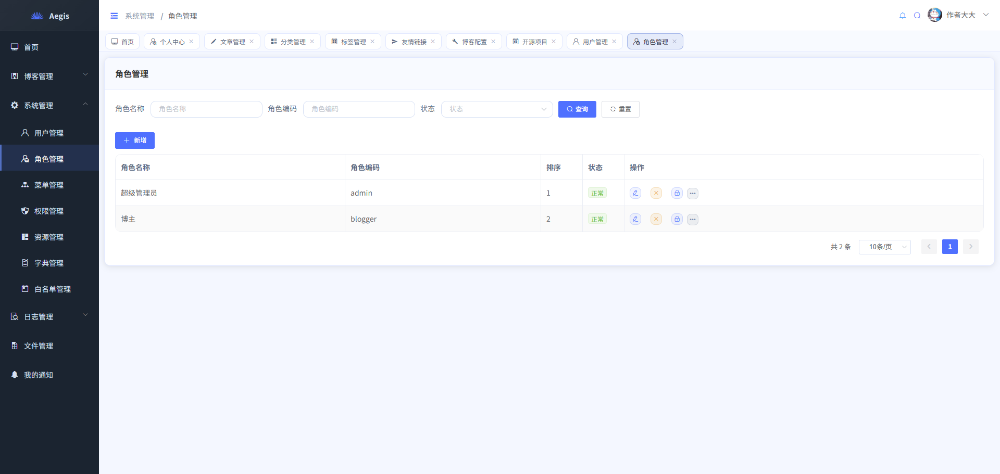
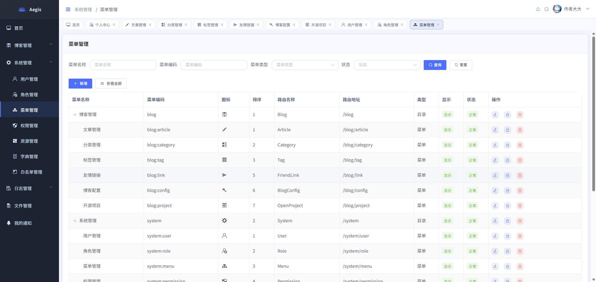

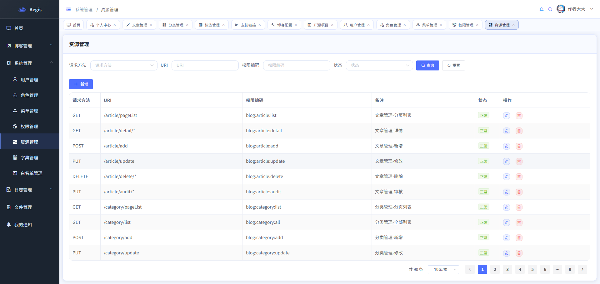
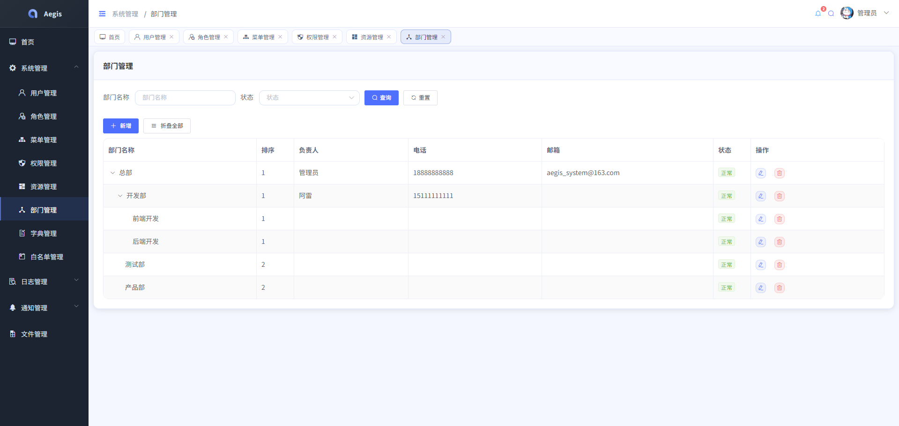
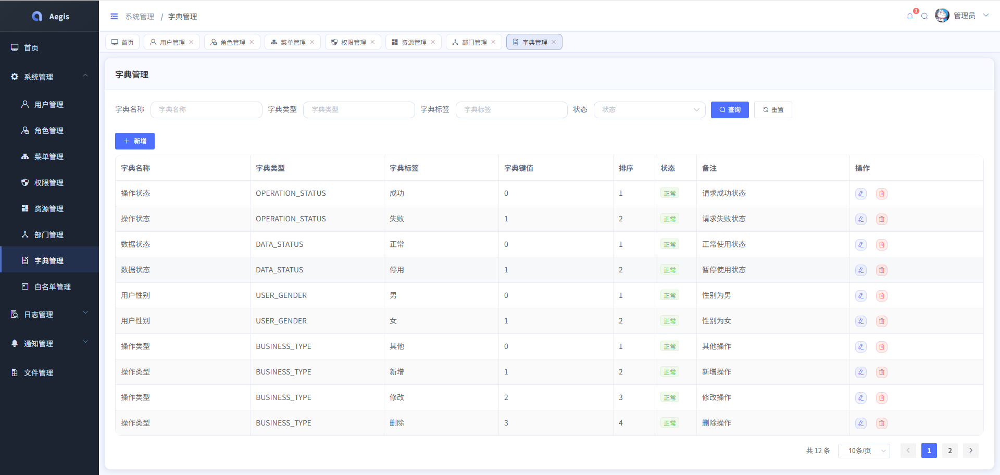
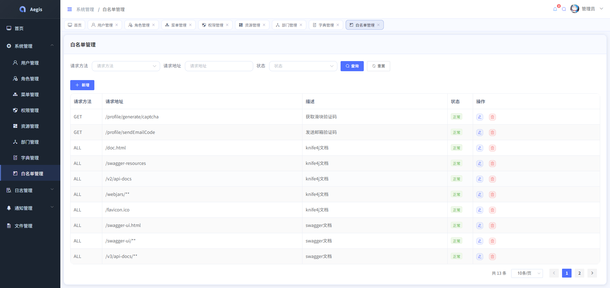
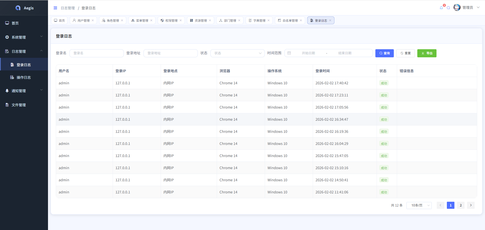
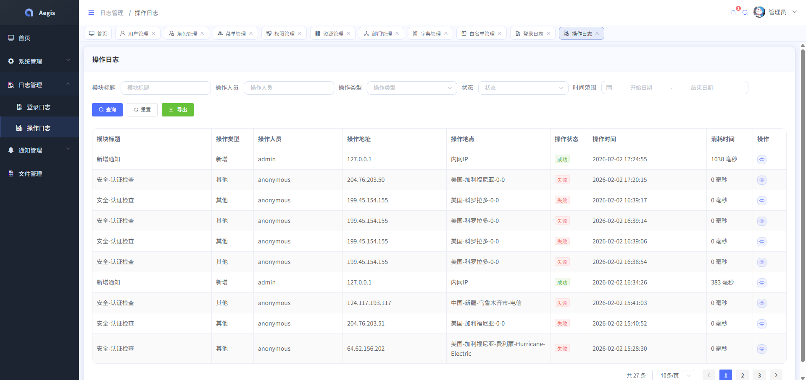
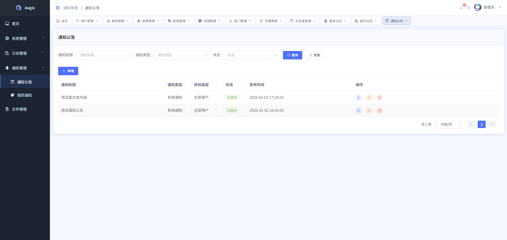
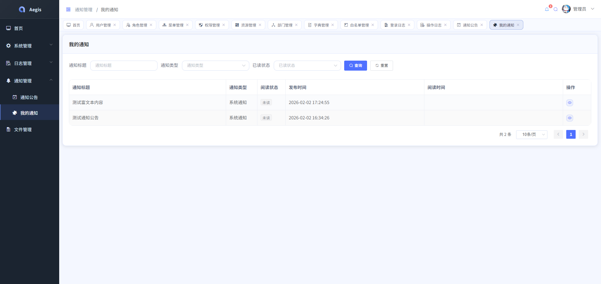

## 🤝 贡献指南

我们欢迎社区贡献！请遵循以下步骤：

1. Fork 本仓库
2. 创建特性分支 (`git checkout -b feature/amazing-feature`)
3. 提交更改 (`git commit -m 'Add some amazing feature'`)
4. 推送到分支 (`git push origin feature/amazing-feature`)
5. 提交 Pull Request

## 📄 许可证

本项目基于 [MIT License](LICENSE.txt) 许可证开源。

## 👥 团队

- **南常** - 项目负责人 - [228389787@qq.com](mailto:228389787@qq.com)

## 🙏 致谢

感谢以下开源项目：

- 🔥 [JetBrains](https://www.jetbrains.com/)- 世界最好的IDE
- [Vue](https://v2.cn.vuejs.org/) - 基础框架
- [Vuex](https://vuex.vuejs.org/zh/)- 存储管理
- [Vue Router](https://router.vuejs.org/)- 路由管理
- [Element UI](https://element.eleme.cn/#/zh-CN) - 组件库
- [Axios](https://axios-http.com/) - HTTP请求库
- [Echarts](https://echarts.apache.org/zh/index.html) - 图表库
- [wangeditor](https://www.wangeditor.com/) - 富文本编辑器

## 📞 支持

如果您在使用过程中遇到问题，可以通过以下方式寻求帮助：

- 📧 邮件: [228389787@qq.com](mailto:228389787@qq.com)
- 🐛 Issue: [提交Issue](https://github.com/OOMEcho/aegis-vue/issues)
- 📖 文档: [项目Wiki](https://github.com/OOMEcho/aegis-vue/wiki)

---

<div align="center">

**如果这个项目对您有帮助，请给它一个 ⭐ Star！**

Made with ❤️ by [南常](https://github.com/OOMEcho)

</div>